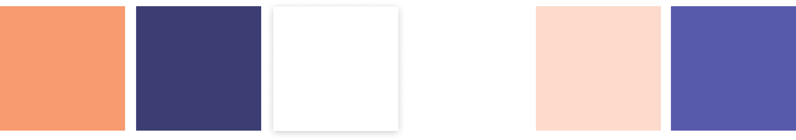
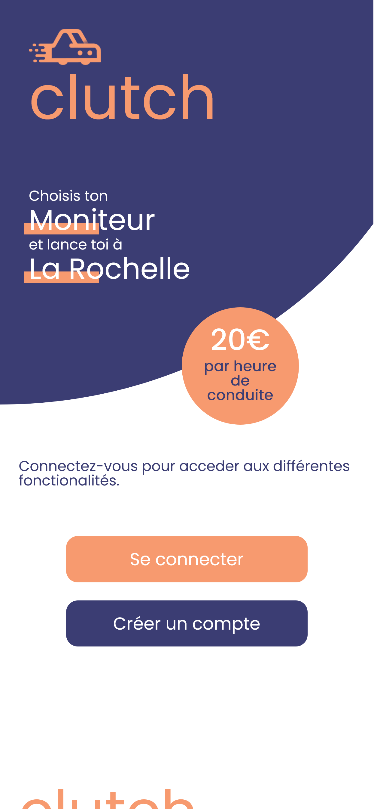
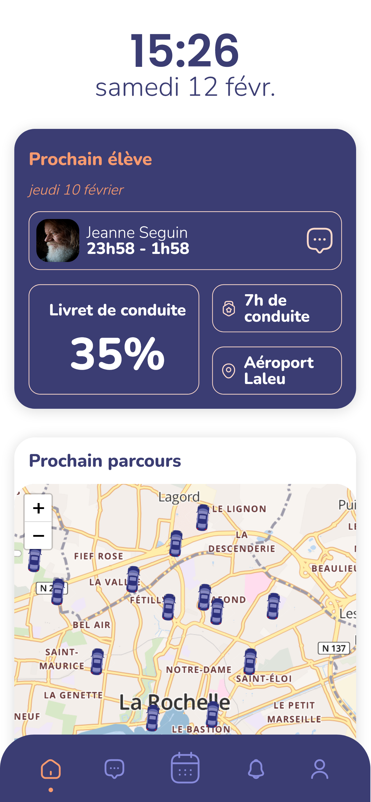
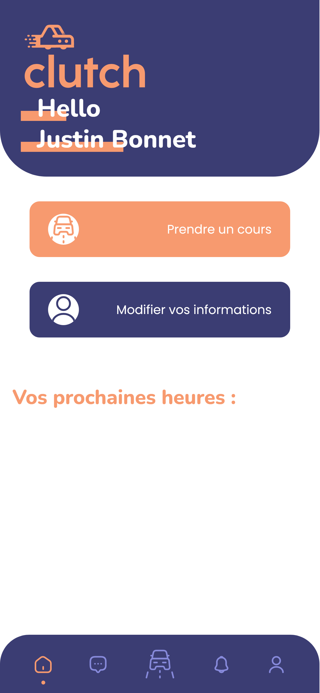
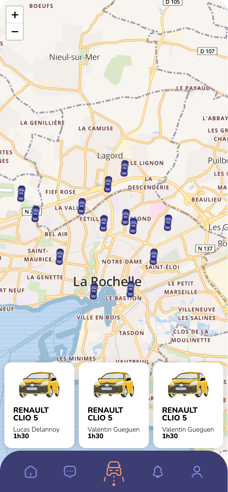
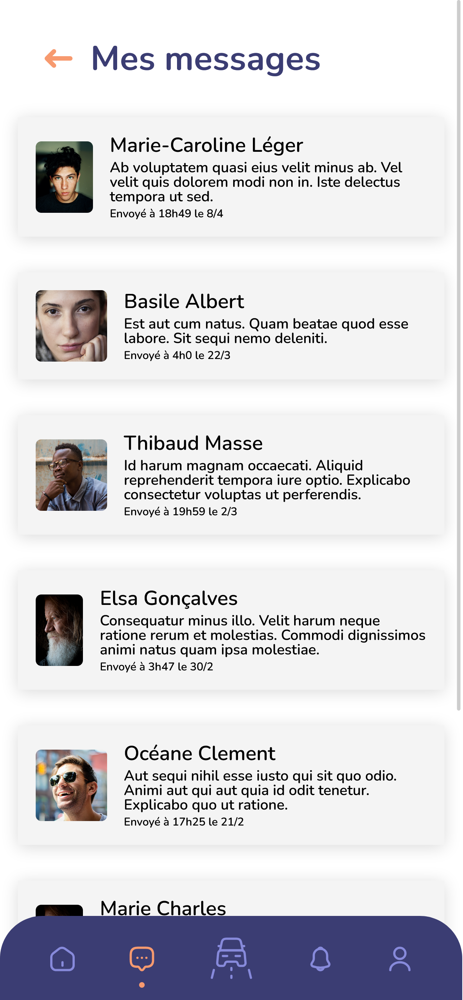
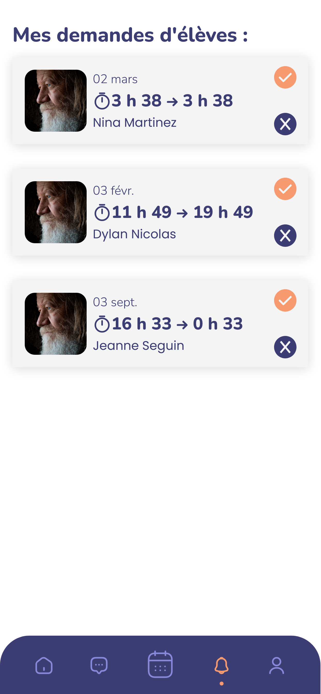
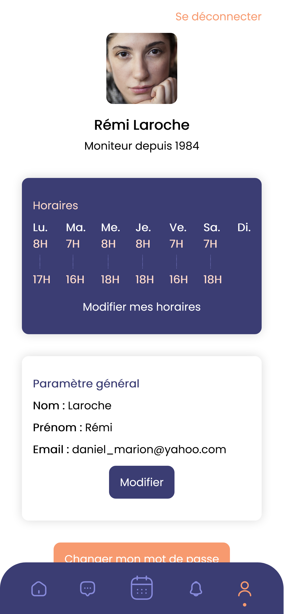
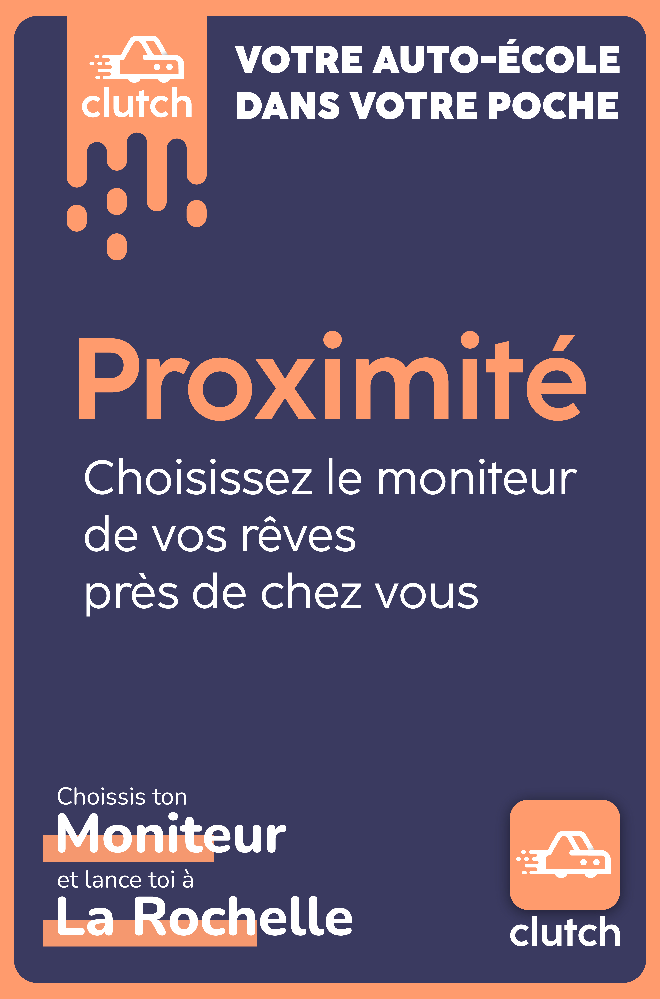

# Hackaton React 2022 - clutch
Moad Benayadi - Lucas Bouchet - Manon Deleest - Océane Guilloizeau - Benjamin Pelaudeix - Valentin Rougier - Florian Toribio

**Ressources :**
- [Figma du projet](https://www.figma.com/file/1XPuijBWrDbjBRFCuZwtel/Clutch?node-id=0%3A1).
- [Présentation du projet](public/documents/Clutch.pdf)
## Le sujet
Il existe de nombreux moniteurs d'auto-écoles indépendants sur La Rochelle. Le nombre de moniteurs ne leur permettent
toujours de se faire connaître dignement et donc à trouver des élèves. Leur activité nécessite du travail administratif : créneaux d'heures de conduites, contact des élèves, lieux de départ/arrivée, réservations et paiement d'heures de conduite etc.
L'objectif est de créer une plateforme rochelaise qui accompagnera les moniteurs dans leur tâche.

Ce hackaton s'est déroulé du 10/02 9h au 11/02 16h30, s'en est suivi d'une présentation devant les responsables de la formation ainsi que le professeur de React. Le jury a joué le rôle de potentiels investisseurs, afin de nous plonger dans le projet de A à Z : de sa conception à sa promotion.
## Notre projet
Aider les moniteurs dans leurs démarches est une de nos priorités, mais pas la seule. Il nous semble important de mettre en place une plateforme aidant également les élèves de ces auto-écoles afin de rendre cette plateforme utile à 100%.
### Design

#### Logo & Nom
Ce logo, conçu pour l'occasion représente une voiture avec un effet de vitesse. Il met également en valeur le nom de l'application web : **clutch**, qui représente "embrayage" en anglais.

#### Charte graphique
Nous avons choisis ces couleurs :

Mais aussi ces typographies :

### Développement
#### Technologies
Pour le hackaton, un starter pack nous a été proposé :
- Projet React basé sur create-react-app
- API conçue avec JSON-SERVER

Nous avons également utilisé la technologie SASS/SCSS pour le style.
#### Fonctionnalités

*Voici un aperçu des principales fonctionnalités développées !*

##### Page d'accueil et connexion :

##### Dashboard Moniteur & Élève :

##### Carte interactive & Tchat :

##### Prochain cours & Profil :

### Communication
Pour promouvoir notre produit, nous avons mis en place une stratégie de communication. Celle-ci comprend la création  :
- d'affiches (abri-bus, affichage municipal, affiche murale...)
- d'une vidéo promotionelle

#### Affiches

#### Vidéo Promotionelle
[Vidéo promotionelle du produit](https://docs.google.com/file/d/1p86Xh_hvIPh4Fn0K6Bj-6SRvP3ZwSkAA/view)

